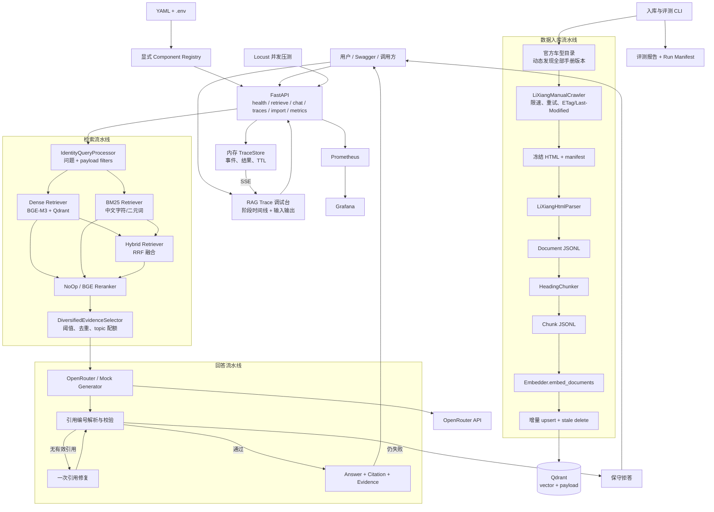

# 当前项目实现架构

> 更新时间：2026-08-16。本文描述当前代码真实实现；`MVP_*` 文档保留最初最小版本，`TECHNICAL_DESIGN.md` 保留完整目标和设计依据。

## 1. 当前结论

项目已经从最小 Dense RAG 扩展为可替换、可评测、可观测的单体 RAG：官方车型目录发现、全车型增量入库、Dense/BM25/Hybrid 召回、可选精排、证据选择、严格引用生成、单次请求 Trace、离线分层评测和并发压测均有实际代码入口。

当前 Web 页面只包含面向开发者的 RAG Trace 调试台，不是终端用户产品。项目仍不包含 Agent、多租户权限、消息队列和分布式部署。自然语言问答可通过 Trace 调试台、Swagger 或 `/v1/chat` 使用。

## 2. 完整运行架构



## 3. 稳定接口与可替换实现

| 稳定端口 | 当前实现 | 可直接切换的配置值 | 更换后是否重建索引 |
|---|---|---|---:|
| `Chunker` | `HeadingChunker` | `data.chunker=heading` | 是 |
| `Embedder` | BGE-M3、确定性 Hash | `bge_m3_local` / `hash_mock` | 是 |
| `VectorStore` | Qdrant、内存实现 | `qdrant` / `in_memory` | 是 |
| `QueryProcessor` | Identity | `identity` | 否 |
| `Retriever` | Dense、BM25、Hybrid | `dense` / `bm25` / `hybrid` | 否；当前 BM25 在进程内构建 |
| `Reranker` | NoOp、BGE v2 M3 | `noop` / `bge_local` | 否 |
| `EvidenceSelector` | 去重和 topic 多样化 | `diversified` | 否 |
| `Generator` | OpenRouter、Mock | `openrouter` / `mock` | 否 |

装配集中在 `app/wiring.py`，显式映射在 `app/registry.py`。流水线只接收领域对象，不把 Qdrant、FlagEmbedding 或 OpenRouter SDK 类型暴露给上层。

## 4. Qdrant collection 与字段

当前 collection `lixiang_mvp_bge_m3_v1` 使用 1024 维 Cosine 向量。每个 point 包含：

```text
point.id = chunk_id 对应的 UUID
point.vector = BGE-M3 dense vector
point.payload = Chunk 的全部可追溯字段
```

payload 包括 `manual_id`、`snapshot_id`、`vehicle_model`、`topic_id`、`title`、`text`、`section_path`、`source_url`、`content_hash` 和扩展 metadata。Qdrant 的 point 本来就是“向量 + payload”，字段用于过滤、返回正文和引用，不参与向量距离计算。高频过滤字段建立 KEYWORD payload index。

全车型索引额外保存 `manual_key`、`manual_name`、`manual_version`，并为 `manual_key` 和 `manual_name` 建立 KEYWORD index。全车型 BGE-M3 collection 为 `lixiang_all_manuals_bge_m3_v1`。

## 5. 数据与增量策略

```text
data/raw/20250916141802/
  index.html
  topics/*.html
  manifest.jsonl
  metadata.json

data/normalized/20250916141802/
  documents.jsonl     # 196 条
  chunks.jsonl        # 848 条
```

全车型数据使用二级隔离：

```text
data/raw/{manual_key}/{snapshot_id}/...
data/normalized/{manual_key}/{snapshot_id}/documents.jsonl
data/normalized/{manual_key}/{snapshot_id}/chunks.jsonl
```

车型目录当前发现39份手册版本、7,645个唯一 topic。“车型”按官网下拉条目定义，保留年款、Pro/Max/Ultra、焕新版等差异，不能只合并为八个车系。

采集器对可变页面发送 `If-None-Match` / `If-Modified-Since`，304 时复用本地文件；带 snapshot 的不可变路径在断点续跑时直接复用已原子写入的页面。入库根据稳定 `chunk_id + content_hash` 跳过未变化 point，并删除同一 snapshot 中已不存在的旧 chunk。

跨车型/年款的重复正文使用 SQLite 持久化 Embedding 缓存。缓存身份由 `Embedding 组件 ID + 去除车型和手册版本前缀后的正文哈希`组成，因此相同正文只计算一次向量；写入 Qdrant 的 payload、原始 chunk 文本和回答引用仍保留 `manual_key`、车型名和版本。首轮实测中，ONE 2021 的 558 个 chunk 有 421 个复用 ONE 2020 的向量（命中率75.4%）。每次入库在 `reports/runs/` 保存配置哈希、组件 ID、数据版本、缓存命中数和计时。

## 6. 检索、证据与引用粒度

回答引用粒度是最终送给 LLM 的 chunk，而不是整个页面。引用同时返回 `chunk_id`、标题、章节路径、来源 URL 和正文摘录。

多章节问题不会强制由一个 chunk 回答：Retriever 先取 Top-N，Reranker 重排，EvidenceSelector 按内容哈希去重并限制单 topic 数量，从而保留跨 topic 证据。LLM 输出中的 `[1]`、`[2]` 必须对应 EvidenceBundle；缺失或越界时尝试一次修复，仍失败则拒答。

## 7. 离线评测闭环

`data/eval/full_v1.jsonl` 使用证据组表达“一个答案必须覆盖多份证据”：

- `single_chunk`：55 条；
- `multi_chunk_same_topic`：20 条；
- `multi_topic`：10 条；
- `unanswerable`：15 条。

可回答问题计算 Recall@5/10、MRR@10、去重证据组后的 nDCG@10、证据组覆盖率和全部证据命中率；不可回答问题只参与证据阈值校准。答案侧计算答案要点覆盖、引用正确性、引用格式与拒答正确性。

重要边界：85 条可回答问题由冻结 chunk 结构化生成，证据 ID 已校验，但问题自然度、答案要点和同义表达仍需人工逐条复核。当前报告是模块对比基线，不是正式准确率。

本次本机结果：

| Retriever | Recall@5 | MRR@10 | nDCG@10 | All-groups@10 |
|---|---:|---:|---:|---:|
| BM25 | 0.947 | 0.767 | 0.811 | 0.976 |
| Dense | 0.965 | 0.857 | 0.880 | 1.000 |
| Hybrid RRF | 0.971 | 0.892 | 0.906 | 1.000 |

## 8. 性能与可观测性

FastAPI 暴露 HTTP 请求量、状态码、端到端延迟、各流水线阶段延迟和错误计数。Prometheus 抓取 API 与 Qdrant，Grafana 读取 Prometheus。

当前 BGE Embedder 和 Reranker 都采用线程锁保护共享模型。短压测明确显示本机 CPU Reranker 是瓶颈：5 并发时 NoOp 精排约 11.24 req/s、P95 170 ms；启用 BGE Reranker 后约 0.62 req/s、P95 8.1 s。生产化优先级应是独立批处理推理服务或 GPU，而不是先扩 Qdrant。

真实 OpenRouter 问答冒烟已返回两条有效 chunk 引用；单次总耗时 62.7 秒，其中 LLM 43.4 秒。因为 `openrouter/free` 会动态选择模型，这只能证明链路可用，正式答案质量和性能评测必须固定模型 slug。

详见 `reports/performance/README.md`。合成规模实验必须写入 `synthetic_` 前缀的隔离 collection，不能污染 848 条业务点。

### 8.1 单次请求 RAG Trace

调试台入口为 `/trace-console`。一次调试请求使用三个接口：

- `POST /v1/traces`：创建后台问答任务并返回 `trace_id`；
- `GET /v1/traces/{trace_id}/events`：用 SSE 顺序推送阶段事件；
- `GET /v1/traces/{trace_id}`：返回当前快照，支持刷新和断线恢复。

Trace 使用请求级 `ContextVar` 绑定 Recorder；`asyncio.to_thread()` 会将当前上下文复制到检索工作线程，因此无需修改 Retriever、Reranker 和 Generator 的稳定接口。普通 `/v1/chat` 没有绑定 Recorder，埋点函数直接返回。

当前事件覆盖：

```text
request
  -> embedding 输入、向量维度、部分维度与统计摘要
  -> Dense/BM25 原始候选与 Hybrid RRF 分项贡献
  -> Reranker 全部得分、名次变化与最多六组 Pair 样本
  -> EvidenceSelector 逐候选保留/淘汰原因
  -> LLM 实际 messages 与原始输出
  -> 引用解析、修复尝试、拒答或最终响应
```

Embedding 不把全部向量铺在页面上，默认展示前 32 维、最大绝对值维度和统计量。Reranker 展示全部候选分数，只展开精排 Top-3、升降幅最大候选等代表性 Pair。这里的“过程”是可验证的输入、配置、输出和排序变化，不声称解释神经网络内部隐层计算。

TraceStore 当前是带 TTL、最大请求数和单请求事件数限制的进程内存实现。它与 import job 具有相同边界：服务重启后丢失，多 worker 不共享；生产化时需替换为 Redis Stream 或持久化存储，并给完整 Prompt/正文 Trace 增加鉴权和脱敏。

## 9. 当前边界与下一步

已实现但仍需继续验证的事项：

1. 人工复核 85 条可回答样本后冻结 `eval_dataset_version`；
2. 固定具体 OpenRouter 模型，再跑答案质量与真实 LLM 并发；
3. 在 10k/100k/1m 合成 collection 上执行容量曲线；
4. BM25 当前每次请求从 Qdrant 拉取并在进程内计算，仅适合学习和小数据对比；规模化时替换为持久化稀疏索引；
5. 单机内存 import job 与 metrics 不跨多 worker 共享，生产部署需外部任务状态和集中指标。
6. 全车型问题应先确定 `manual_key`/手册版本再检索；未选择车型时，只依赖语义文本区分相似年款，存在串用风险。
7. Trace 调试台当前只适合受信任的开发环境；完整 LLM 输入可能包含正文，尚未实现用户级鉴权与字段脱敏。
