# 模块化 RAG 架构设计

> 本文说明模块边界和替换规则。实际已装配组件、运行链路、数据量与实测结果见 [当前项目实现架构](CURRENT_IMPLEMENTATION_ARCHITECTURE.md)。文中的 Generic HTML、Recursive/Semantic Chunker、远程 Embedding 等是扩展位，不代表已经实现。

## 1. 设计目标

系统采用“稳定流水线 + 接口契约 + 可替换适配器 + 配置装配”的结构。

核心目标：

- 主流程只依赖抽象接口，不直接依赖 BGE、Qdrant、OpenRouter 等具体实现。
- 数据解析、分块、Embedding、召回、重排、证据选择和生成均可独立替换。
- 每次替换都生成独立的 `experiment_id`、配置快照和结果，能够公平复现。
- 更换不同模块时，明确哪些数据和索引必须重建，避免不同实验互相污染。

第一版使用 Python `Protocol`、显式 Factory 和 YAML 配置实现依赖注入，不引入复杂插件框架或运行时动态扫描。

## 2. 总体架构

```mermaid
flowchart TB
    ENTRY["FastAPI / CLI / Evaluation / Locust"]
    CONFIG["ExperimentConfig<br/>YAML + 环境变量"]
    REGISTRY["Component Registry<br/>名称到 Factory 的显式映射"]
    MANIFEST["Run Manifest<br/>配置哈希、数据版本、模型版本、指标"]

    subgraph APP["稳定应用层：只编排，不包含供应商逻辑"]
        INGEST_PIPE["IngestionPipeline"]
        RETRIEVE_PIPE["RetrievalPipeline"]
        CHAT_PIPE["ChatPipeline"]
    end

    subgraph PORTS["稳定端口：Python Protocol"]
        SOURCE_PORT["SourceConnector"]
        PARSER_PORT["DocumentParser"]
        CHUNK_PORT["Chunker"]
        EMBED_PORT["Embedder"]
        STORE_PORT["VectorStore"]
        QUERY_PORT["QueryProcessor"]
        RETRIEVER_PORT["Retriever"]
        RERANK_PORT["Reranker"]
        EVIDENCE_PORT["EvidenceSelector"]
        GENERATOR_PORT["Generator"]
    end

    subgraph DOMAIN["稳定领域对象"]
        RAW["RawDocument"]
        DOC["Document"]
        CHUNK["Chunk"]
        QUERY["RetrievalQuery"]
        CANDIDATE["ScoredChunk"]
        EVIDENCE["EvidenceBundle"]
        ANSWER["Answer + Citation"]
    end

    subgraph ADAPTERS["可替换适配器"]
        SOURCE_IMPL["LiXiangHttp<br/>LocalSnapshot"]
        PARSER_IMPL["LiXiangHtml<br/>GenericHtml / Markdown"]
        CHUNK_IMPL["Heading<br/>Recursive / Semantic"]
        EMBED_IMPL["BGE-M3 Local<br/>Remote Embedding"]
        STORE_IMPL["Qdrant<br/>InMemory Test Store"]
        QUERY_IMPL["Identity<br/>Rewrite / Expansion"]
        RETRIEVER_IMPL["Dense<br/>BM25 / Hybrid"]
        RERANK_IMPL["NoOp<br/>BGE Reranker / API"]
        EVIDENCE_IMPL["TopK Threshold<br/>Diversified Selector"]
        GENERATOR_IMPL["OpenRouter<br/>Mock / Local LLM"]
    end

    ENTRY --> INGEST_PIPE
    ENTRY --> RETRIEVE_PIPE
    ENTRY --> CHAT_PIPE
    CONFIG --> REGISTRY
    REGISTRY --> APP
    APP --> MANIFEST

    INGEST_PIPE --> SOURCE_PORT --> SOURCE_IMPL
    INGEST_PIPE --> PARSER_PORT --> PARSER_IMPL
    INGEST_PIPE --> CHUNK_PORT --> CHUNK_IMPL
    INGEST_PIPE --> EMBED_PORT --> EMBED_IMPL
    INGEST_PIPE --> STORE_PORT --> STORE_IMPL

    RETRIEVE_PIPE --> QUERY_PORT --> QUERY_IMPL
    RETRIEVE_PIPE --> RETRIEVER_PORT --> RETRIEVER_IMPL
    RETRIEVE_PIPE --> RERANK_PORT --> RERANK_IMPL
    RETRIEVE_PIPE --> EVIDENCE_PORT --> EVIDENCE_IMPL

    CHAT_PIPE --> RETRIEVE_PIPE
    CHAT_PIPE --> GENERATOR_PORT --> GENERATOR_IMPL

    SOURCE_PORT -.-> RAW
    PARSER_PORT -.-> DOC
    CHUNK_PORT -.-> CHUNK
    QUERY_PORT -.-> QUERY
    RETRIEVER_PORT -.-> CANDIDATE
    EVIDENCE_PORT -.-> EVIDENCE
    GENERATOR_PORT -.-> ANSWER
```



依赖方向必须保持为：

```text
入口层 -> 流水线 -> 端口/领域对象 <- 适配器
```

流水线不能直接 `import QdrantClient`、`FlagEmbedding` 或 OpenRouter SDK；这些依赖只能出现在 adapters 中。

## 3. 三条稳定流水线

### 3.1 数据入库流水线

```text
SourceConnector
  -> RawDocument
  -> DocumentParser
  -> Document
  -> Chunker
  -> Chunk[]
  -> Embedder.embed_documents
  -> VectorStore.upsert
```

每个阶段均输出可持久化中间产物。比较解析器或分块器时，从冻结的 `RawDocument` 快照重新运行，避免重新抓取网页导致数据版本变化。

### 3.2 检索流水线

```text
RetrievalQuery
  -> QueryProcessor
  -> Retriever.retrieve Top-N
  -> Reranker.rerank
  -> EvidenceSelector.select
  -> EvidenceBundle
```

`Retriever` 负责候选召回，可以是 dense、BM25 或 hybrid；`Reranker` 只重排候选，不负责生成答案；`EvidenceSelector` 独立执行阈值、去重、多样性和证据预算控制。

Retriever 允许由其他端口组合而成：`DenseRetriever(embedder, vector_store)`，`HybridRetriever(dense_retriever, sparse_retriever, fusion)`。这些依赖由 Factory 注入，不能在 Retriever 内部自行读取全局配置或创建客户端。

### 3.3 问答流水线

```text
用户请求
  -> RetrievalPipeline
  -> EvidenceBundle
  -> Generator.generate
  -> Answer + Citation
```

Generator 只能接收 `EvidenceBundle`，不能自行访问 Qdrant。这样替换 LLM 时，输入证据完全一致，回答质量对比才有效。

## 4. 稳定领域对象

领域对象不包含任何厂商 SDK 类型，建议使用 Pydantic 定义：

```python
class RawDocument(BaseModel):
    source_id: str
    source_url: str
    snapshot_id: str
    content: bytes
    content_hash: str
    metadata: dict[str, Any]

class Document(BaseModel):
    document_id: str
    title: str
    sections: list[Section]
    metadata: dict[str, Any]

class Chunk(BaseModel):
    chunk_id: str
    document_id: str
    text: str
    section_path: list[str]
    metadata: dict[str, Any]

class ScoredChunk(BaseModel):
    chunk: Chunk
    recall_score: float | None = None
    rerank_score: float | None = None
    rank: int
    retriever_id: str

class EvidenceBundle(BaseModel):
    query_id: str
    items: list[ScoredChunk]
    rejected_reason: str | None = None
```

关键规则：

- `chunk_id` 由原始数据版本、解析器版本、分块器版本和正文哈希共同决定。
- `recall_score` 与 `rerank_score` 分开保存，不能用同一个 `score` 覆盖。
- 所有候选保留 `retriever_id`，Hybrid 检索时可以追踪候选来自哪个通道。
- Evidence 是实际传给 Generator 的正文；候选命中不自动成为最终证据。

## 5. 模块端口

| 端口 | 最小职责 | 可替换实现 |
|---|---|---|
| `SourceConnector` | 获取并版本化原始内容 | 理想官网、本地快照、其他网站 |
| `DocumentParser` | 原始格式转标准 Document | 理想 HTML、通用 HTML、Markdown、PDF |
| `Chunker` | Document 转 Chunk | 标题分块、递归分块、语义分块 |
| `Embedder` | 文档和问题转向量 | 本地 BGE、远程 Embedding API |
| `VectorStore` | 建索引、写入、查询和删除版本 | Qdrant、内存测试实现 |
| `QueryProcessor` | 查询标准化或改写 | Identity、Query Rewrite、Multi-Query |
| `Retriever` | 返回 Top-N 候选 | Dense、BM25、Hybrid |
| `Reranker` | 对固定候选重排 | NoOp、本地 BGE、远程 Rerank API |
| `EvidenceSelector` | 阈值、去重和证据预算 | Top-K、MMR、按 topic 多样化 |
| `Generator` | 基于 Evidence 生成引用答案 | OpenRouter、Mock、本地 LLM |

端口只定义业务输入输出。例如：

```python
class Chunker(Protocol):
    @property
    def component_id(self) -> str: ...

    def split(self, document: Document) -> list[Chunk]: ...


class Retriever(Protocol):
    @property
    def component_id(self) -> str: ...

    async def retrieve(
        self,
        query: RetrievalQuery,
        *,
        top_k: int,
    ) -> list[ScoredChunk]: ...
```

## 6. 配置装配

所有模块由 YAML 选择，API 代码不出现模型名称：

```yaml
experiment:
  id: dense-bge-heading-v1

data:
  snapshot_id: "20250916141802"
  source: lixiang_http
  parser: lixiang_html_v1
  chunker: heading
  chunker_options:
    target_chars: 500
    overlap_chars: 80

index:
  embedder: bge_m3_local
  vector_store: qdrant
  index_version: bge-m3__heading-500__v1

retrieval:
  query_processor: identity
  retriever: dense
  recall_top_k: 10
  reranker: bge_reranker_v2_m3
  evidence_selector: threshold_topk
  evidence_top_k: 3

generation:
  generator: openrouter
  model: fixed-model-slug
```

显式 Registry 负责根据名字构造组件：

```python
CHUNKERS = {
    "heading": HeadingChunker,
    "recursive": RecursiveChunker,
}

RETRIEVERS = {
    "dense": DenseRetriever,
    "hybrid": HybridRetriever,
}
```

不要使用 `eval()`、任意 import 路径或自动扫描目录加载组件。显式注册更容易测试，也能避免错误配置执行任意代码。

## 7. 更换模块时的影响范围

| 更换模块 | 是否重新抓取 | 是否重新解析/分块 | 是否重新 Embedding | 是否重建索引 |
|---|---:|---:|---:|---:|
| `SourceConnector` 实现，但原始快照相同 | 否 | 否 | 否 | 否 |
| `DocumentParser` | 否 | 是 | 是 | 是 |
| `Chunker` | 否 | 是 | 是 | 是 |
| `Embedder` | 否 | 否 | 是 | 是 |
| `VectorStore` | 否 | 否 | 使用已有向量可选 | 是 |
| Dense 改为相同向量上的检索参数 | 否 | 否 | 否 | 通常否 |
| Dense 改为 BM25/Hybrid | 否 | 视实现而定 | 否 | 需要词法/稀疏索引 |
| `QueryProcessor` | 否 | 否 | 仅重新计算查询向量 | 否 |
| `Reranker` | 否 | 否 | 否 | 否 |
| `EvidenceSelector` | 否 | 否 | 否 | 否 |
| `Generator` | 否 | 否 | 否 | 否 |

Embedding 模型变化时不得复用旧向量空间。推荐每套 Embedding + Chunker 组合使用独立 collection：

```text
lixiang__bge-m3__heading-500__v1
lixiang__bge-m3__recursive-500__v1
lixiang__other-embedding__heading-500__v1
```

不要把两个不同 Embedding 模型生成的向量写进同一个匿名 vector 字段。即使维度相同，它们的向量空间也不一定可比较。

## 8. 公平对比方法

### 8.1 比较数据处理模块

冻结同一个 raw snapshot 和同一套问答集，只改变 parser/chunker。每个方案使用独立 `index_version`，比较：

- chunk 数量与长度分布；
- Recall@K、MRR、nDCG；
- 索引构建时间和存储量；
- 检索 P95/P99。

### 8.2 比较 Retriever

冻结 Chunk、Embedding 和过滤条件，只替换 `Retriever`。Dense、BM25、Hybrid 必须使用相同 `recall_top_k`，并保留每个候选的来源通道和原始分数。

### 8.3 比较 Reranker

先把同一 Retriever 产生的候选保存为 JSONL，然后让多个 Reranker 重排完全相同的候选集。这样可以排除召回波动。

### 8.4 比较 Generator

冻结 `EvidenceBundle`，分别调用不同 Generator。比较引用正确率、答案要点覆盖率、拒答率、延迟和成本，不能让不同 LLM 重新检索证据。

### 8.5 端到端比较

端到端实验允许同时改变多个模块，但必须保存：

```text
experiment_id
git_commit
raw_snapshot_id
eval_dataset_version
component_ids
component_options
index_version
random_seed
started_at / finished_at
metrics
```

## 9. 调整后的项目结构

```text
app/
  domain/                 # Pydantic 领域对象，无第三方 SDK 类型
  ports/                  # Protocol 接口
  pipelines/              # ingestion、retrieval、chat 编排
  bootstrap/              # 配置读取、Registry、Factory
  adapters/
    sources/              # 理想官网、本地快照
    parsers/              # 理想 HTML、Markdown 等
    chunkers/             # heading、recursive、semantic
    embeddings/           # BGE-M3、远程 Embedding
    vectorstores/         # Qdrant、内存测试实现
    retrievers/           # dense、BM25、hybrid
    rerankers/            # no-op、BGE、远程 API
    generators/           # OpenRouter、mock、本地 LLM
  api/                    # FastAPI 路由，只调用 pipeline
configs/
  baseline.yaml
  experiments/            # 每个对比实验一份配置
evaluation/               # 模块级和端到端评测
artifacts/{experiment_id}/
  config.snapshot.yaml
  run_manifest.json
  candidates.jsonl
  evidence.jsonl
  metrics.json
```

## 10. 测试边界

- 每个 adapter 通过对应 port 的 contract tests。
- Pipeline 单元测试全部使用 InMemory/Mock adapter，不启动 Qdrant 和外部 API。
- Qdrant、BGE 和 OpenRouter 放在 integration tests。
- 离线评测只读冻结数据，不在评测过程中修改索引。
- 每个阶段统一记录输入条数、输出条数、耗时、失败原因和 `component_id`。

这套结构的核心不是让所有组件都能随意热插拔，而是通过少量稳定接口控制替换范围，并让每次替换都能复现、隔离和量化。
