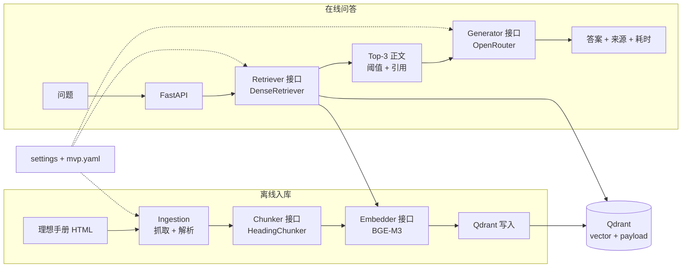

# 最小 RAG Demo 架构（历史基线）

> 当前实现已经补充 Hybrid、Reranker、多证据评测、压测与监控。真实架构见 [当前项目实现架构](CURRENT_IMPLEMENTATION_ARCHITECTURE.md)。

## 1. MVP 目标

第一阶段只证明一件事：理想汽车手册能够被采集、分块、写入 Qdrant，并通过语义检索为 LLM 提供可追溯正文。

```text
手册 HTML -> Chunk -> Embedding -> Qdrant -> Query -> Top-K -> LLM -> 引用答案
```

MVP 不追求一次完成全部生产能力。模块化只保留未来最可能对比的边界，不提前建设复杂插件系统。

## 2. 最小架构图



## 3. MVP 只保留的模块

| 模块 | 是否抽象接口 | 第一版实现 | 原因 |
|---|---:|---|---|
| `Ingestion` | 否 | 理想手册专用抓取与解析 | 当前只有一个已确认数据源 |
| `Chunker` | 是 | `HeadingChunker` | 后续需要对比递归/语义分块 |
| `Embedder` | 是 | 本地 `BGE-M3` | 模型可能切换为远程 API |
| `VectorStore` | 是 | `QdrantVectorStore` | 隔离 Qdrant SDK，便于单测 |
| `Retriever` | 是 | `DenseRetriever` | 后续需要对比 BM25/Hybrid |
| `Generator` | 是 | `OpenRouterGenerator` | 支持 Mock 和其他 LLM |
| `API` | 否 | FastAPI | 只负责参数校验和调用服务 |

接口与实现先放在同一个模块中，不再拆成 `ports/`、`adapters/`、`registry/` 三层。例如：

```text
retrieval/
  base.py       # Retriever Protocol
  dense.py      # DenseRetriever
```

当某类实现增长到 3 个以上，再独立拆分 adapters。

## 4. 第一版删除或延期的模块

| 延期项 | MVP 替代方案 | 什么时候再加 |
|---|---|---|
| Query Rewrite / Multi-Query | 原问题直接检索 | 基线召回率不足时 |
| Reranker | Qdrant Top-3 直接作为证据 | Dense 基线评测完成后 |
| BM25 / Hybrid | 只做 Dense Retrieval | 专有名词、型号召回较差时 |
| 独立 EvidenceSelector | 在 ChatService 中做阈值 + Top-3 | 出现去重、MMR、预算需求时 |
| Component Registry | `wiring.py` 显式构造 | 同类实现超过 2～3 个时 |
| 通用 Parser 接口 | 理想手册专用 parser | 接入 PDF、Markdown 或第二网站时 |
| 异步入库任务 | CLI 命令同步入库 | 数据量明显增大或需要 Web 上传时 |
| 图片下载、OCR、VLM | 只保存图片 URL 和 alt | 文本问答无法覆盖图示问题时 |
| Prometheus / Grafana | 结构化日志和 `timings_ms` | 开始稳定并发压测时 |
| Locust / synthetic 百万向量 | 手工请求和小规模计时 | 问答闭环及离线基线完成后 |
| 100 条完整评测集 | 先做 20 条冒烟集 | 检索链路稳定后扩充 |
| 多车型、多版本、权限 | 固定一个手册快照 | 单手册闭环完成后 |

这些模块不是 RAG 原理上的必要部分，而是质量优化、扩展性或生产治理能力。

## 5. 最小项目结构

```text
app/
  models.py                 # Chunk、SearchResult、Answer、Citation
  settings.py               # 环境变量和 YAML 配置
  wiring.py                 # 显式创建各组件
  ingestion/
    crawler.py              # 抓取 index 和 topic
    parser.py               # 理想 HTML 转 Document
    chunker.py              # Chunker Protocol + HeadingChunker
    service.py              # 入库编排
  retrieval/
    embedder.py             # Embedder Protocol + BGE-M3
    vector_store.py         # VectorStore Protocol + Qdrant
    base.py                 # Retriever Protocol
    dense.py                # DenseRetriever
  generation/
    base.py                 # Generator Protocol
    openrouter.py           # OpenRouterGenerator
    mock.py                 # 单测与无 Key 开发
    service.py              # 阈值、Top-3、Prompt 和引用
  api/
    main.py
    schemas.py
tests/
  unit/
  integration/
configs/
  mvp.yaml
data/
  raw/
  normalized/
  eval/smoke.jsonl
```

## 6. 最小接口

只保留五类核心协议：

```python
class Chunker(Protocol):
    def split(self, document: Document) -> list[Chunk]: ...

class Embedder(Protocol):
    def embed_documents(self, texts: list[str]) -> list[list[float]]: ...
    def embed_query(self, text: str) -> list[float]: ...

class VectorStore(Protocol):
    def upsert(self, chunks: list[Chunk], vectors: list[list[float]]) -> None: ...
    def search(self, vector: list[float], top_k: int) -> list[SearchResult]: ...

class Retriever(Protocol):
    def retrieve(self, question: str, top_k: int) -> list[SearchResult]: ...

class Generator(Protocol):
    async def generate(self, question: str, contexts: list[SearchResult]) -> Answer: ...
```

`DenseRetriever` 是对 Embedder 和 VectorStore 的轻量组合，不额外引入复杂检索框架。

## 7. 最小运行入口

```text
python -m app.ingestion.service   # 抓取、解析、分块、写入 Qdrant
uvicorn app.api.main:app          # 启动 API
POST /v1/retrieve                 # 验证语义召回
POST /v1/chat                     # 验证带引用问答
GET  /health                      # 检查服务状态
```

第一阶段完成标准：

1. 同一份手册重复入库不会产生重复 chunk。
2. `/v1/retrieve` 能返回 Top-K 正文、分数和来源 URL。
3. `/v1/chat` 只能使用召回正文回答，并返回引用。
4. 无证据问题能够拒答。
5. 20 条冒烟问题可以重复执行并输出 Recall@5。

## 8. 后续演进顺序

```text
最小 Dense RAG
  -> 建立 20～100 条评测集
  -> 加 Reranker 做固定候选对比
  -> 加 BM25/Hybrid 做召回对比
  -> 加 Locust 与分阶段监控
  -> 扩展车型、版本和生产治理
```

扩展必须由评测结果驱动，而不是仅因为某个模块在完整架构图中存在。
